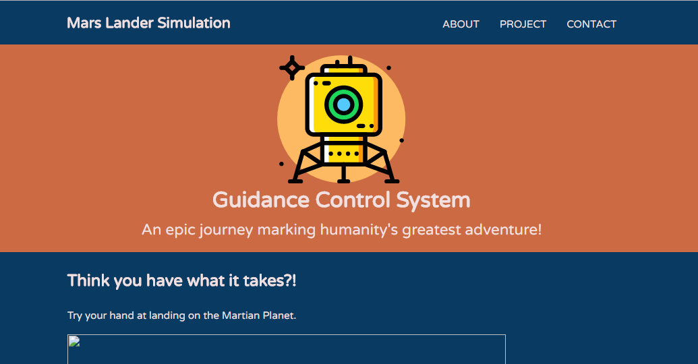
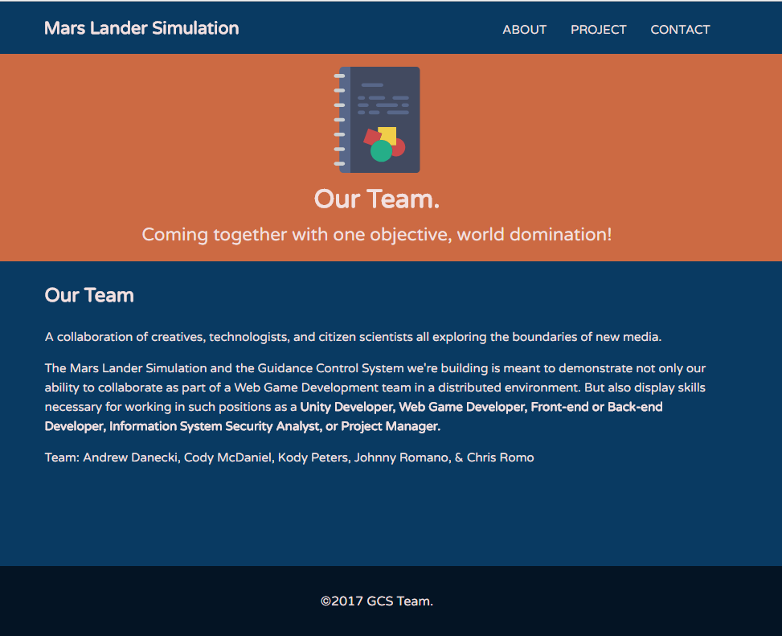
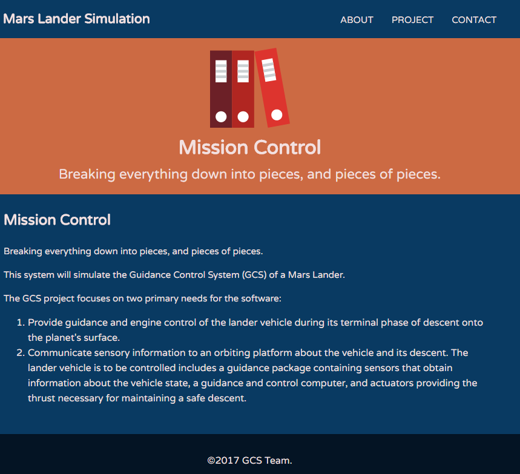
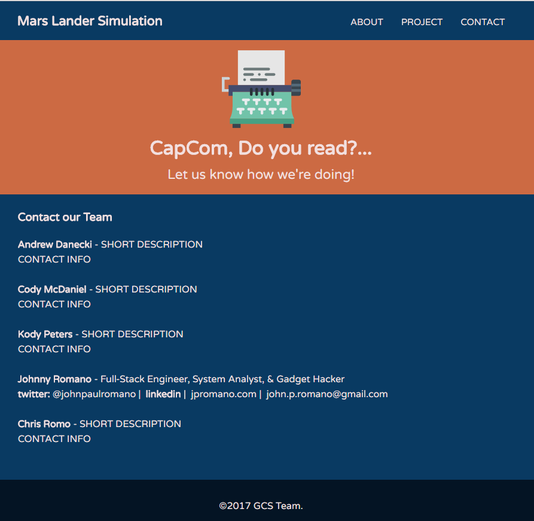

#Mars Lander Simulation website
Build the website that will host the Unity3d simulation of the Guidance Control System (GCS) of a Mars Lander.

Team: Andrew Danecki, Cody McDaniel, Kody Peters, Johnny Romano, & Chris Romo 
<a href="https://trello.com/marslander">Check the progress on Trello.</a>

#Page Screens

 

<a href="http://www.flaticon.com/authors/madebyoliver">Free Icons</a> were designed by Oliver Farshi | MadeByOliver.com

